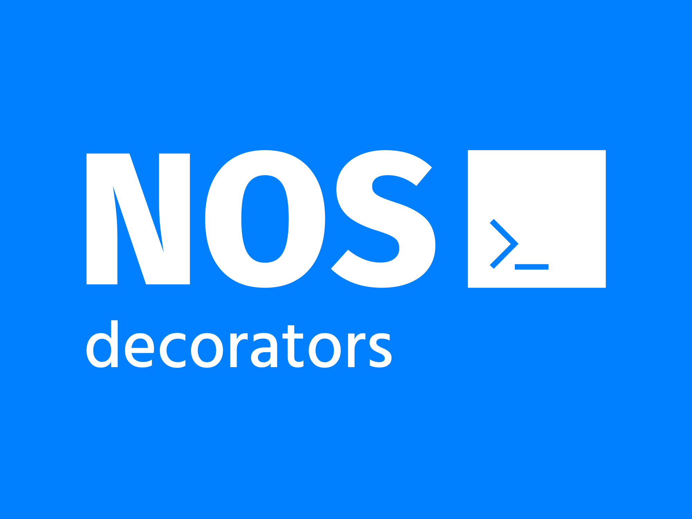

# NOS decorators

[](https://github.com/project-nos/decorators/actions/workflows/tests.yml)
[](https://github.com/project-nos/decorators/blob/master/LICENSE)
[](https://www.npmjs.com/package/@project-nos/decorators)
[](https://bundlephobia.com/package/@project-nos/decorators)

### A library to help you develop spryker frontend components fast and easy.

You no longer have to write all the boilerplate code needed to bring your components to life. Under the hood this library uses typescript decorators to automatically bind attributes, actions and targets to your Spryker frontend components.

There is no better way to get a feel for what NOS decorators is and what it can do, than by seeing it for yourself:

Imagine you create a hello-world component which generates following html:

```html
<hello-world some-number="123" some-boolean some-string="baz" some-array="[4,5,6]" some-object="{"foo":"bar"}" some-getter-setter="bar">
  <button hello-world-action="click#foo" hello-world-target="bar">…</button>
  <div hello-world-targets="bazs">...</div>
  <div hello-world-targets="bazs">...</div>
</hello-world>
```

You no longer need to query for elements inside your `init` function, listen for events or create `getters` for attributes. Everything you have to do is to add the corresponding decorators to your class and properties.


```typescript
import Component from 'ShopUi/models/component';
import { actionable, attributable, attribute, targetable, target, targets } from '@project-nos/decorators';

@actionable()
@attributable()
@targetable()
export default class HelloWorld extends Component {
    @attribute({ type: Number })
    protected declare someNumber: number;

    @attribute({ type: Boolean })
    protected declare someBoolean: boolean;

    @attribute({ type: String })
    protected declare someString: string;

    @attribute({ type: Array })
    protected declare someArray: [];

    @attribute({ type: Object })
    protected declare someObject: object;
    
    #someGetterSetter = String();
    
    get someGetterSetter(): string {
        return this.#someGetterSetter;
    }
    
    @attribute({ type: String })
    set someGetterSetter(value: string) {
        this.#someGetterSetter = value;
    }

    @target()
    protected declare bar: HTMLButtonElement;

    @targets()
    protected declare bazs: HTMLDivElement[];

    protected readyCallback(): void {}

    foo(event: Event) {
        //...
    }
}
```

***

## Documentation

For full documentation, visit our [Wiki](https://github.com/project-nos/decorators/wiki).

## License

Copyright (c) [Andreas Penz](https://github.com/andreaspenz). Licensed unter the [MIT License](https://github.com/project-nos/decorators/blob/master/LICENSE).

